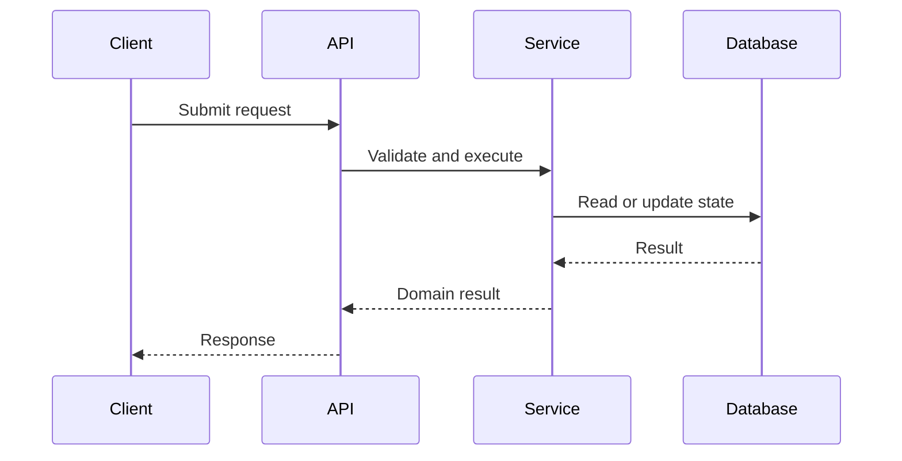

# Effective Codebase Documentation

Create documentation that helps developers understand, use, modify, debug, and operate a codebase without duplicating details that are better expressed by the code itself.

## Core principles

* Treat the repository as the source of truth.
* Verify claims against implementation, configuration, tests, and build files.
* Explain intent, boundaries, behavior, and tradeoffs rather than narrating every line.
* Separate confirmed facts from assumptions and unresolved questions.
* Prefer links to canonical definitions over copied code.
* Optimize documentation for future maintenance, not only immediate completeness.
* Write for the least-informed intended reader without hiding important technical detail.
* Never invent commands, APIs, architecture, dependencies, or behavior.

## Documentation workflow

### 1. Define the documentation target

Determine:

* The repository, package, subsystem, feature, or workflow being documented.
* The intended audience.
* The questions the documentation must answer.
* The expected output format.
* Whether the goal is onboarding, reference, architecture explanation, operations, debugging, or change documentation.

When the scope is unclear, infer it from the request and repository structure. State any important assumptions.

### 2. Build a repository map

Inspect the codebase before writing.

Identify:

* Top-level directories.
* Entry points.
* Build and package files.
* Runtime configuration.
* Core modules and packages.
* Public interfaces.
* Tests and fixtures.
* Scripts and developer tooling.
* Deployment and infrastructure files.
* Existing documentation.
* Generated or vendored files.
* Ownership or contribution metadata.

Create a concise mental model of how the repository is organized.

Do not assume directory names accurately represent their contents. Inspect representative files.

### 3. Identify the execution model

Trace how the system starts and processes work.

Document:

* Startup sequence.
* Main control flow.
* Initialization order.
* Request, event, command, or job lifecycle.
* Important state transitions.
* Shutdown and cleanup behavior.
* Background processes.
* Concurrency and synchronization boundaries.
* External services involved.

For each major workflow, identify:

1. What triggers it.
2. Which component receives it.
3. How data moves through the system.
4. Where decisions are made.
5. What side effects occur.
6. What result or failure is produced.

### 4. Extract the architecture

Identify the major architectural elements:

* Components and responsibilities.
* Module boundaries.
* Dependency direction.
* Shared abstractions.
* Data ownership.
* Persistence layers.
* External integrations.
* Extension points.
* Security boundaries.
* Performance-sensitive paths.

Explain why each major boundary exists when evidence is available.

Avoid describing architecture only as a directory tree. Focus on runtime and dependency relationships.

### 5. Verify behavior through multiple sources

Cross-check important claims against:

* Implementation code.
* Type definitions.
* Tests.
* Configuration schemas.
* CLI help.
* API specifications.
* Build scripts.
* Migration files.
* CI workflows.
* Deployment manifests.
* Existing documentation.

Tests often reveal expected behavior, edge cases, and invariants more clearly than implementation alone.

When sources disagree, treat executable behavior and current tests as stronger evidence, but explicitly note the inconsistency.

### 6. Document public interfaces

For APIs, libraries, commands, plugins, or services, document:

* Purpose.
* Inputs.
* Outputs.
* Preconditions.
* Error behavior.
* Side effects.
* Authentication or authorization.
* Stability expectations.
* Minimal usage examples.
* Relevant implementation location.

Do not list every internal function unless the user explicitly requests API reference documentation.

Prefer examples that reflect actual supported usage.

### 7. Document data and configuration

Explain:

* Important data structures.
* Data lifecycle and ownership.
* Serialization formats.
* Storage systems.
* Schema constraints.
* Required and optional configuration.
* Default values.
* Configuration precedence.
* Environment variables.
* Secrets handling.
* Migration or compatibility concerns.

Never expose real credentials, tokens, personal data, or secret values.

Use placeholders in examples.

### 8. Document development workflows

Include only verified commands.

Cover relevant workflows such as:

* Installing dependencies.
* Building.
* Running locally.
* Running tests.
* Linting and formatting.
* Generating code.
* Creating migrations.
* Debugging.
* Packaging.
* Releasing.
* Deploying.

For every command, specify:

* The directory it should run from.
* Required prerequisites.
* Expected outcome.
* Common failure conditions when known.

Do not present an unverified command as working.

### 9. Capture invariants and constraints

Document facts that future contributors could easily violate:

* Required ordering.
* Thread-safety assumptions.
* Ownership rules.
* Naming constraints.
* Compatibility guarantees.
* Performance limits.
* Security requirements.
* Protocol assumptions.
* Generated-file rules.
* Unsupported use cases.
* Known architectural debt.

These constraints are often more valuable than descriptions of individual files.

### 10. Explain failure modes

Document:

* Common errors.
* Where errors originate.
* How failures surface.
* Relevant logs or diagnostics.
* Recovery behavior.
* Retry semantics.
* Partial-failure behavior.
* Troubleshooting steps.
* Known limitations.

Troubleshooting guidance must be tied to actual observable symptoms.

### 11. Select the correct documentation form

Choose the smallest set of documents that adequately serves the audience.

Possible outputs include:

* Repository README.
* Architecture overview.
* Developer onboarding guide.
* Subsystem guide.
* API reference.
* Configuration reference.
* Operational runbook.
* Troubleshooting guide.
* Contribution guide.
* Architecture decision record.
* Change documentation.

Avoid creating many fragmented files when one well-structured document would be easier to maintain.

## Recommended repository README structure

Use this structure when creating or improving a main README:

1. Project overview
2. Key capabilities
3. Architecture summary
4. Repository layout
5. Prerequisites
6. Setup
7. Running locally
8. Testing and validation
9. Configuration
10. Common workflows
11. Troubleshooting
12. Deployment or release process
13. Contribution guidance
14. Known limitations
15. Further documentation

Omit sections that are irrelevant.

## Recommended architecture document structure

1. Purpose and scope
2. System context
3. Major components
4. Dependency relationships
5. Runtime lifecycle
6. Primary data flows
7. Persistence model
8. External integrations
9. Extension points
10. Reliability and failure handling
11. Security boundaries
12. Performance considerations
13. Key design decisions
14. Known limitations
15. Relevant source locations

## Recommended subsystem document structure

1. Responsibility
2. Public interface
3. Internal components
4. Control flow
5. Data model
6. Dependencies
7. Configuration
8. Error handling
9. Testing strategy
10. Extension guidance
11. Constraints and invariants
12. Source map

## Source references

When referring to implementation details:

* Include precise file paths.
* Include symbol names when useful.
* Include line numbers only when the output environment supports stable line references.
* Prefer linking to a canonical definition rather than copying large code blocks.
* Use short excerpts only when they materially improve understanding.
* Clearly label pseudocode as pseudocode.

Example:

```text
Request routing begins in `src/server/router.ts` through
`createRouter()`. Authentication is applied before handlers are
registered, so new routes inherit the shared authentication middleware
unless explicitly mounted elsewhere.
```

## Diagrams

Use diagrams only when they communicate relationships more clearly than prose.

Suitable diagram types:

* Component diagrams.
* Dependency diagrams.
* Sequence diagrams.
* Data-flow diagrams.
* State diagrams.
* Deployment diagrams.

Keep diagrams focused.

A diagram should:

* Have a clear purpose.
* Use names that match the codebase.
* Avoid unnecessary implementation details.
* Be accompanied by a textual explanation.
* Remain editable when possible.

Prefer Mermaid when the target documentation system supports it.

Example:



Do not create diagrams based on guessed relationships.

## Writing requirements

Documentation must be:

* Accurate.
* Concrete.
* Structured.
* Searchable.
* Easy to scan.
* Consistent with repository terminology.
* Explicit about assumptions.
* Free of promotional filler.
* Free of vague claims such as “simple,” “robust,” or “scalable” unless supported.
* Detailed enough to support action.
* Concise enough to remain maintainable.

Prefer:

```text
The worker retries failed jobs three times with exponential backoff.
After the final attempt, the job is moved to the dead-letter queue.
```

Avoid:

```text
The system provides robust and seamless error handling.
```

## Documentation maintenance rules

To reduce documentation drift:

* Link to code instead of reproducing large implementation details.
* Document stable concepts more deeply than volatile details.
* Mark generated documentation clearly.
* Identify the source of generated values.
* Note version-specific behavior.
* Keep commands executable.
* Update related documentation when changing public behavior.
* Remove obsolete documentation rather than leaving contradictory guidance.
* Add validation or documentation tests when practical.

Recommend automation for:

* Broken-link checks.
* Example compilation.
* CLI reference generation.
* API schema generation.
* Documentation builds.
* Stale-file detection.
* Diagram validation.

## Handling uncertainty

Use these labels when appropriate:

* **Confirmed:** Directly supported by code, tests, or configuration.
* **Inferred:** Strongly suggested by repository evidence but not explicitly guaranteed.
* **Unverified:** Could not be confirmed from the available codebase.
* **Outdated:** Existing documentation conflicts with the current implementation.
* **Open question:** Requires maintainer clarification.

Never silently convert an inference into a fact.

## Review checklist

Before finalizing documentation, verify:

### Accuracy

* Every important behavioral claim is supported by repository evidence.
* Commands exist and use the correct paths.
* File and symbol names are current.
* Defaults match the implementation.
* Examples use valid syntax.
* External dependencies are correctly identified.

### Coverage

* A new contributor can identify where execution begins.
* Major components and responsibilities are explained.
* Core workflows are traceable.
* Configuration and data ownership are documented.
* Important constraints and failure modes are visible.
* Relevant development workflows are included.

### Maintainability

* Volatile implementation details are not unnecessarily duplicated.
* Links point to canonical sources.
* Sections have clear ownership or scope.
* Outdated documentation has been removed or corrected.
* Uncertainty is explicitly marked.

### Usability

* The document answers the audience’s likely questions.
* Important setup instructions appear before optional details.
* Headings are descriptive.
* Examples are minimal but complete.
* Terminology is consistent.
* Readers can navigate from overview to implementation.

## Output behavior

When documenting a codebase, produce:

1. A concise summary of what was inspected.
2. The requested finished documentation.
3. A source map listing the most relevant files and symbols.
4. Any uncertainties, conflicts, or missing information.
5. Recommended documentation follow-ups, limited to high-value gaps.

When the task is an audit rather than a rewrite, produce:

1. Current documentation strengths.
2. Incorrect or stale claims.
3. Missing critical information.
4. Structural and usability issues.
5. A prioritized improvement plan.
6. Replacement text for the highest-impact sections.

## Constraints

* Do not modify implementation code unless explicitly requested.
* Do not claim to have run commands that were not run.
* Do not infer runtime behavior solely from filenames.
* Do not expose secrets or sensitive repository content.
* Do not document generated or vendored code as if it were authored locally.
* Do not produce exhaustive file-by-file narration unless explicitly requested.
* Do not preserve incorrect existing documentation merely for consistency.
* Do not hide conflicting evidence.
